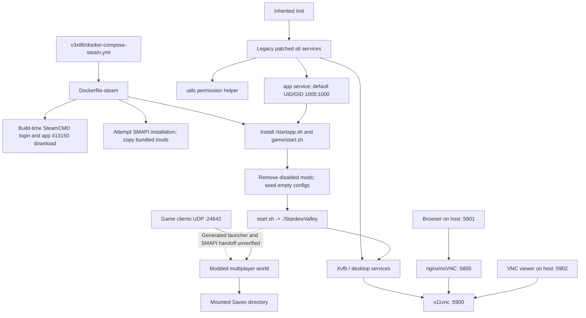
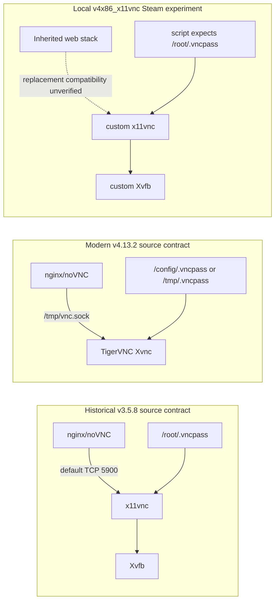

# Stardew Docker project: current-state and container-upgrade audit

**Audit date:** September 13, 2026  
**Research type:** Technical deep dive and operational handoff  
**Repository:** [kbridgford/stardew-docker-muliarch](https://github.com/kbridgford/stardew-docker-muliarch)  
**Inspected checkout:** `/home/kaze/code/stardew-docker-muliarch`  
**Local HEAD:** `d7ed0558ff555ef48312530e75d5211c67b6aa76`  
**Primary path:** `v3x86/docker-compose-steam.yml` and `v3x86/docker/Dockerfile-steam`, selected because of the user's IDE context, not because a running deployment was identified.[^snapshot]

## 1. Executive summary

This project hosts a graphical Stardew Valley game with mods that support unattended multiplayer; the inspected launch chain does not start a separate dedicated-server executable, and it still needs a working display and game graphics context.[^launch][^server-docs] The selected Compose configuration publishes the browser GUI on **host TCP 5801**, native VNC on **host TCP 5902**, and gameplay on **UDP 24642**.[^compose] The reported historical failure was specifically a **jlesage GUI-baseimage v3-to-v4 transition while remaining on Debian 11**, with MonoGame failing during OpenGL initialization; the failed v4.5.3 implementation explicitly disabled GLX, while upstream added GLX/llvmpipe support in **v4.8.0 on June 20, 2025**, making a controlled modern retest worthwhile but not establishing a fix.[^issue145][^old-glx][^glx-release] Registry metadata collected during research associates the selected bare `debian-11` tag with the old v3.5.8 amd64 image, not current v4, and Debian 11's ordinary Debian LTS period ended **August 31, 2026**.[^registry][^debian] Independently of graphics, the checkout contains architecture inconsistencies, masked SMAPI-install failures, launcher/liveness problems, and stale mod configuration; a reliable modernization plan must separate those problems rather than treating a base-tag edit as sufficient.[^build][^launch][^arm-build][^stale-mod-config]

## 2. Scope, provenance, and evidence rules

Six focused research assignments covered runtime wiring, VNC/GUI access, upstream issues, architecture/build variants, bundled mods, and the historical inherited image contract. Research was read-only: no image builds or pulls, game execution, container deployment, dependency changes, or credential-value disclosure. This report is the only requested deliverable; it does not claim the application currently runs.

The local branch was `master`; local HEAD and the locally stored `origin/master` reference matched. HEAD was committed January 4, 2025. The initial and final working-tree observations were clean. No remote fetch established that the local tracking reference equals GitHub's present branch tip. All local code permalinks below use the inspected SHA, not a moving branch.[^snapshot]

Evidence labels used throughout:

- **Source fact:** directly inspected code, configuration, metadata, or upstream implementation.
- **Historical report:** a user's or maintainer's statement in an issue; not independently reproduced.
- **Inference:** a reasoned interpretation of source facts, explicitly bounded.
- **Proposal:** a next-step or acceptance criterion, not existing implementation.
- **Unknown:** requires deployment or executable-artifact evidence that this audit did not collect.

Empty files, missing files, Git status, and binary metadata do not have meaningful source line numbers. Their citations identify the snapshot, path, or metadata location instead of inventing lines.[^snapshot][^binary-evidence]

### Key repositories

| Repository | Role in this audit | Boundary |
|---|---|---|
| [kbridgford/stardew-docker-muliarch](https://github.com/kbridgford/stardew-docker-muliarch) | Local implementation and experimental variants | Primary evidence is the inspected local SHA.[^snapshot] |
| [jlesage/docker-baseimage-gui](https://github.com/jlesage/docker-baseimage-gui) | GUI services, graphics capability, image tags, upgrade discussion | Historical and modern source revisions are kept separate.[^legacy-gui][^modern-gui] |
| [jlesage/docker-baseimage](https://github.com/jlesage/docker-baseimage) | Inherited init, application user, HOME/XDG, supervisor | Its version numbering is independent of GUI-baseimage versioning.[^legacy-base][^modern-base] |
| [printfuck/stardew-multiplayer-docker](https://github.com/printfuck/stardew-multiplayer-docker) | Related modernization discussion | Its Debian 10/SMAPI statements do not describe the selected local file.[^issue47] |
| [cavazos-apps/stardew-multiplayer-docker](https://github.com/cavazos-apps/stardew-multiplayer-docker) | Related historical upgrade attempt | Linked issue closure was administrative, not a demonstrated fix.[^closed-issue] |

## 3. Repository map and variant selection

There is no root README or root Compose file. The checkout has three principal version directories whose READMEs are byte-identical, despite materially different Dockerfiles. The directory names do not establish support status or which variant is deployed. The selected Steam Dockerfiles were introduced on January 4, 2025 in the order `v3arm`, `v4x86_x11vnc`, then `v3x86`; those commits establish introduction, not successful operation.[^snapshot]

| Variant | Selected build / platform declaration | Base and important differences |
|---|---|---|
| `v3x86` Steam | `docker/Dockerfile-steam`; no explicit platform | Bare `debian-11`; downloads **ARM64 .NET SDK 5.0.408** despite the directory name; attempts SMAPI 4.0.8; inherits GUI services.[^build][^compose] |
| `v3arm` Steam | `docker/Dockerfile-steam`; **`build.platforms: [linux/amd64]`** | `debian-11-v4`; x64 .NET SDK 6.0.427; SMAPI install and bundled-mod copy commented out.[^arm-selected] |
| `v3arm` separate ARM64 experiment | `docker/Dockerfile-steam-arm64`; not selected by tracked Compose | `debian-12-v4.6`; ARM64 .NET 5.0.408; Box86/Box64 installation; separate, unverified emulation experiment.[^arm-build] |
| `v4x86_x11vnc` Steam | `docker/Dockerfile-steam`; no explicit platform | `debian-11-v4`; replaces inherited Xvnc with Xvfb/x11vnc; also downloads ARM64 .NET 5.0.408.[^custom-gui][^v4-build] |
| GOG in all three directories | Local `docker/Dockerfile-gog`; no explicit platform | Byte-identical Dockerfiles; bare `debian-11`; ARM64 .NET 5.0.408; supplied installer files; not the custom v4 Steam GUI replacement.[^gog] |

**Important correction:** `build.platforms` is not service-level `platform`. The ARM-named Compose file explicitly targets an amd64 build; the arm64 build target is commented out. Do not summarize this repository as having working ARM64 support.[^arm-selected]

Other files that are easy to misinterpret:

- `v3arm/start.sh` and `v3arm/startapp.sh` are outside the selected `docker` build context; they are not the files copied by that Dockerfile.[^arm-selected][^arm-extra]
- `v3arm/docker/Dockerfile-baseimage` is an xterm test image, not the parent of the ARM experiment.[^arm-extra]
- `v4x86_x11vnc/xml/rc.xml` contains Openbox window rules, but is outside the selected build context and has no inspected copy/mount wiring.[^openbox]
- Root `pullValleyBin.sh` is a host-side SteamCMD helper, not part of the selected Docker build chain.[^host-helper]
- Tracked `:Zone.Identifier` sidecars are present; do not treat them as executable implementation or evidence of supported platforms.[^snapshot]

## 4. How the server is built and started

### 4.1 Architecture overview

The following diagram combines local source wiring with the **historical v3.5.8 source contract associated with the bare tag**. It is not a process capture from a running container. The exact source-to-image-build attestation and deployed digest remain unknown.[^registry][^legacy-base][^legacy-gui][^build][^launch]



### 4.2 Build-time acquisition and installation

The Compose service is `valley`, with container name `stardew`, build context `docker`, and Dockerfile `Dockerfile-steam`. Build arguments supply `STEAM_USER`, `STEAM_PASS`, `STEAM_GUARD`, and app ID `413150`. Credential values are intentionally not reproduced.[^compose]

The Dockerfile:

1. Inherits `jlesage/baseimage-gui:debian-11`, sets `GAME_PATH=/data/Stardew/game`, and installs packages including Mono, xterm, gettext/envsubst, jq, locales, and 32-bit Steam prerequisites.
2. Downloads SteamCMD, runs initialization, authenticates, and executes `app_update ... validate` into the game directory.
3. Copies 32-bit and 64-bit Steam client libraries into `/data/.steam`.
4. Downloads the **Linux ARM64 .NET SDK 5.0.408** archive.
5. Downloads SMAPI **4.0.8** and attempts installation.
6. Copies mods, helpers, startup scripts, and service definitions; sets game ownership to `1000:1000`.[^build]

Steam acquisition happens during the **image build**, not normal application startup. The game content has no selected depot/build manifest pin; SDK/SMAPI URLs name versions but have no accompanying archive-checksum verification. Base tags and unversioned package installs also leave inputs mutable.[^build]

**Build correctness concerns, not reproduced failures:**

- An ARM64 SDK in the x86-named build is an architecture inconsistency. The actual architecture of every downloaded executable must be inspected before deciding how it fails or whether another runtime masks it.
- The extraction step assumes its destination is available from preceding/inherited state.
- The entire SMAPI download/extract/install chain ends in **`|| :`**. Therefore layer success is not evidence that SMAPI installed.
- `SMAPI_NO_TERMINAL` and `SMAPI_USE_CURRENT_SHELL` are assigned to the pipeline's `echo` command, not explicitly to the installer process on its right.[^build]

### 4.3 Inherited startup contract: what is actually established

The local file named `docker-entrypoint-steam.sh` is copied to **`/startapp.sh`**. It is not installed as a Docker `ENTRYPOINT`; the local Dockerfile does not replace the inherited default command.[^build]

Historical GUI v3.5.8 selects parent `jlesage/baseimage:debian-11-v2.4.6`. At the pinned parent source, the default command is `/init`; the app service switches to `USER_ID:GROUP_ID` before running `/startapp.sh`. Defaults are `1000:1000`. The parent supplies `XDG_CONFIG_HOME=/config/xdg/config`, other XDG paths beneath `/config`, and a `/config` volume. Its init clears HOME, explaining the project's explicit `export HOME=/config`.[^legacy-base][^legacy-app]

The `app/utils.dep` file is **supported by the old image**, not evidence that the project was written only for v4. The old parent uses patched s6 dependency ordering. Without a readiness notification, a dependency waits for service startup, not necessarily completion of a one-shot initialization operation. The local `utils` script only attempts to chmod an empty AutoLoad configuration file; it neither creates missing JSON nor supervises the game.[^legacy-deps][^utils]

### 4.4 Application hook and launcher boundary

At startup, `/startapp.sh`:

1. Sets HOME to `/config`.
2. Normalizes each mod directory name into an `ENABLE_<NAME>_MOD` variable.
3. Deletes a mod directory unless the variable is exactly `true`.
4. Uses `envsubst` to produce `config.json` only when the existing file is missing or empty.
5. Runs a residual RemoteControl helper and starts a background SMAPI-log tailer.
6. Sets XAUTHORITY, attempts a launcher rewrite using `sed`, invokes the game-start wrapper, and finally sleeps for a very long interval.[^launch]

Complete selected Steam wrapper, with its existing comments omitted:

```bash
#!/bin/bash
echo "Running Stardew Valley"
cd "${GAME_PATH}"
chmod +x *
./"StardewValley"
```

Source: `v3x86/docker/start.sh:1-8`.[^start-script]

The important uncertainty is the filename boundary: the hook edits **`Stardew Valley`**, while the wrapper executes **`StardewValley`**. These generated game/installer files are not in the inspected checkout. This does not by itself prove a wrong filename, because one launcher may delegate to the other, but **the full game-to-SMAPI handoff and the `sed` match are unverified**.[^launch][^start-script][^snapshot]

### 4.5 Liveness, logs, and shutdown

The log helper polls every five seconds for `/config/xdg/config/StardewValley/ErrorLogs/SMAPI-latest.txt`, then runs `tail -f`. It has no bounded readiness deadline and is started as a background child, not an independently defined supervised service.[^log-helper]

The selected scripts lack explicit failure propagation for the game, and the application hook reaches an enormous `sleep` after the child returns. Consequently **a running container does not establish a running game**. The old inherited app-finish mechanism normally shuts the container down when the app service exits, but the local sleep prevents a game exit from necessarily reaching that mechanism. This is a local launcher problem distinct from the OpenGL failure.[^launch][^start-script][^legacy-finish]

## 5. VNC and browser access

### 5.1 Actual endpoint map

All six inspected Steam/GOG Compose variants publish the same host/container GUI ports, despite differing internal implementations.[^compose][^other-ports]

| Purpose | Container endpoint | Host endpoint from checked-in Compose |
|---|---|---|
| Browser GUI | TCP 5800 | **TCP 5801** |
| Raw VNC | TCP 5900 | **TCP 5902** |
| Game traffic | UDP 24642 | **UDP 24642** |

The effective port block is:

```yaml
ports:
  - "5902:5900"
  - "5801:5800"
  - "24642:24642/udp"
```

These entries omit a host-IP restriction. Docker normally publishes such mappings on all host interfaces, subject to daemon/network configuration; actual external reachability additionally depends on routing and firewall rules. Neither Internet exposure nor loopback-only deployment was verified.[^compose][^docker-ports]

### 5.2 Connection recipes

These are **derived, unexecuted examples** for a container matching the checked-in mappings, with default unencrypted web mode. They do not establish that a container currently exists or that its GUI has started.[^compose][^legacy-web]

On the Docker host:

```text
Browser: http://127.0.0.1:5801/
Native VNC: host 127.0.0.1, TCP port 5902
```

TigerVNC's explicit-port syntax is:

```sh
vncviewer 127.0.0.1::5902
```

The double colon explicitly selects a TCP port rather than a display number.[^viewer]

For a remote host already reachable on a trusted network, replace `127.0.0.1` with that host's address. Do not use browser port 5800 or native port 5900 on the host unless an override changed the published mappings.[^compose]

**Proposed safer management arrangement:** replace the GUI mappings with loopback bindings, retaining the gameplay mapping according to the intended multiplayer network:

```yaml
ports:
  - "127.0.0.1:5902:5900"
  - "127.0.0.1:5801:5800"
  - "24642:24642/udp"
```

This is a proposed configuration change, not the current file. Ensure an override does not merely add these while leaving the wildcard publications in place.[^compose][^docker-ports]

Then, from an operator workstation with an authorized SSH account:

```sh
SSH_TARGET='operator@your-docker-host'
ssh -N -o ExitOnForwardFailure=yes \
  -L 127.0.0.1:15801:127.0.0.1:5801 \
  -L 127.0.0.1:15902:127.0.0.1:5902 \
  "$SSH_TARGET"
```

Use browser `http://127.0.0.1:15801/` or `vncviewer 127.0.0.1::15902`. A tunnel does not independently disable direct host publications; loopback binding is a separate change. These commands are an SSH proposal, not a repository feature.[^ssh][^viewer][^docker-ports]

### 5.3 Authentication and documentation mismatches

The selected Compose file assigns `VNC_PASSWORD` literally; it does not interpolate `${VNC_PASSWORD}`. Exporting a different same-named shell variable therefore does not replace that assignment. The value is omitted from this audit. Compose also sets 1200x900 dimensions and `X11VNC_EXTRA_OPTS=-noxdamage -reopen -forever`.[^compose]

For the historical inherited stack, a persisted `/config/.vncpass` takes precedence over `VNC_PASSWORD`; initialization prepares `/root/.vncpass`. The old x11vnc service authenticates if that runtime file exists and is nonempty, otherwise selecting no-password mode. This explains why inspecting environment settings alone is insufficient to establish effective authentication.[^legacy-auth]

README discrepancies include a `VNCPASS` example rather than `VNC_PASSWORD`, a loopback-only raw-VNC example while actual Compose restricts neither GUI port, and generic `docker-compose.yml` wording despite Steam/GOG-specific filenames. The README warns against external browser exposure but does not implement a binding restriction.[^readme-vnc][^compose]

### 5.4 GUI ownership: legacy, modern, and custom are different



Legacy sources use separate Xvfb and x11vnc processes and default nginx web proxying to the local VNC TCP endpoint. Modern sources use integrated Xvnc, a Unix-socket web connection, and different runtime password paths.[^legacy-gui][^legacy-web][^legacy-auth][^modern-gui]

The local v4 Steam experiment removes inherited Xvnc, renames dependencies, and installs custom Xvfb/x11vnc services. Its x11vnc script checks `/root/.vncpass`, otherwise choosing `-nopw`, and does not configure the modern `/tmp/vnc.sock` endpoint.[^custom-gui]

**Conditional integration risks:** with a modern inherited initializer/proxy, the custom replacement can disagree about both password location and browser transport. Raw VNC working would not prove browser access works, and a configured password variable would not prove the custom service enforces it. These are source-derived compatibility risks, **not a verified deployed incident or an assertion about the inherited `v3x86` stack**.[^custom-gui][^modern-gui]

## 6. Saves, mod configuration, and server automation

### 6.1 Persistence contract

The selected Compose file bind-mounts:

| Host path | Container path | Purpose |
|---|---|---|
| `/home/kaze/code/stardew-docker-muliarch/v3x86/valley_saves` | `/config/xdg/config/StardewValley/Saves` | Saved worlds |
| `/home/kaze/code/stardew-docker-muliarch/v3x86/configs/autoload.json` | `/data/Stardew/game/Mods/AutoLoadGame/config.json` | AutoLoad selection/configuration |

These host paths are machine-specific, not portable relative paths. There is no whole-game bind mount. The Compose file does not explicitly persist the entire `/config` directory; the historical base declares `/config` as a volume, so any resulting anonymous volume must be accounted for separately rather than assuming all non-save configuration is either persistent or ephemeral. The committed AutoLoad file is empty, and no local `valley_saves` directory was found during research.[^compose][^snapshot][^legacy-base]

Mod enablement is destructive inside a container: disabled directories are removed. Changing an environment flag cannot restore a deleted directory in that same writable filesystem; recreation from an image containing the mod is distinct from restarting. Nonempty JSON also wins over changed environment values, because template generation is seed-once rather than continuous reconciliation.[^launch]

### 6.2 Actual bundled mod inventory

“Default on” means retained by the startup switch, **not verified loaded or compatible**.[^mod-switches]

| Directory | Manifest version | Minimum SMAPI API | Default |
|---|---|---|---|
| Always On Server | `1.20.3-unofficial.2-mikkoperkele` | `4.0.0` | On |
| AutoLoadGame | `1.0.3` | `4.0.0` | On |
| UnlimitedPlayers | `2024.4.16` | Not declared | On |
| ChatCommands | `1.14.0` | `3.0.0` | Off |
| Crops Anytime Anywhere | `1.4.8` | `4.0.0` | Off |
| FriendsForever | `1.2.3` | `2.10.2` | Off |
| NoFenceDecay | `1.5.0` | `2.9.0` | Off |
| NonDestructiveNPCs | `1.0.0` | `3.1.0` | Off |
| TimeSpeed | `2.7.7` | `4.0.0` | Off |

Versions/API floors come from the nine local manifests, not a current compatibility service.[^mod-manifests]

RemoteControl is described in the README and has a residual helper, but is absent from the supplied mod directories. ConsoleCommands has a switch but is not bundled in those directories; a successful external SMAPI installation might supply it, which was not verified.[^remotecontrol][^mod-switches][^snapshot]

### 6.3 Complete AutoLoad template result and typing caveat

The template and checked-in defaults imply this complete initial JSON:

```json
{
  "LastFileLoaded": "null",
  "LoadIntoMultiplayer": "true",
  "ForgetLastFileOnTitle": "true"
}
```

These are **strings**, including `"null"`, not JSON null or booleans. The source-lineage configuration model has a nullable string and two booleans. Whether the exact bundled deserializer coerces these values was not tested; do not label this an established runtime crash.[^autoload-config][^autoload-lineage]

The relevant host override is `ENABLE_AUTOLOADGAME`, while Compose emits container `ENABLE_AUTOLOADGAME_MOD`. Similarly, UnlimitedPlayers uses host `ENABLE_UNLIMITEDPLAYERS`. The checked-in defaults differ from README examples: AutoLoad on rather than `null`, and player limit 10 rather than 8.[^mod-switches][^server-docs]

### 6.4 Always On configuration and activation

The supplied Always On template exposes the following complete set of settings. This table is a compact schema inventory; typing describes the original source model, not proof of the unofficial bundled build's deserialization behavior. Local template output quotes the substituted values.[^always-config][^always-lineage]

| Settings | Source-model type / role |
|---|---|
| `serverHotKey` | Button; local default F9 |
| `profitmargin`, `upgradeHouse` | Integers |
| `petname` | String |
| `farmcavechoicemushrooms`, `communitycenterrun` | Booleans |
| `timeOfDayToSleep` | Integer; local default 2200 |
| `lockPlayerChests`, `clientsCanPause`, `copyInviteCodeToClipboard`, `festivalsOn` | Booleans |
| `eggHuntCountDownConfig`, `flowerDanceCountDownConfig`, `luauSoupCountDownConfig`, `jellyDanceCountDownConfig`, `grangeDisplayCountDownConfig`, `iceFishingCountDownConfig` | Integer countdown settings |
| `endofdayTimeOut`, `fairTimeOut`, `spiritsEveTimeOut`, `winterStarTimeOut`, `eggFestivalTimeOut`, `flowerDanceTimeOut`, `luauTimeOut`, `danceOfJelliesTimeOut`, `festivalOfIceTimeOut` | Integer timeout settings |

The README instructs an operator to create/load a game through the GUI and press F9 for server mode. Original Always On source lineage also contains automatic activation for server saves, no-client pause handling, and progression automation. However, the bundled manifest identifies an unofficial build whose exact source was not established. **Use the README as an operational starting point, not a verified complete activation/pausing specification; blindly toggling F9 is not a readiness test.**[^server-docs][^always-lineage][^binary-evidence]

AutoLoad lineage records the current save name, can load in multiplayer mode, and may clear remembered state on returning to title. That explains why persisted config, actual save selection, and restart behavior require separate acceptance tests. It does not prove the bundled binary has identical control flow.[^autoload-lineage]

### 6.5 Configuration and binary provenance drift

Two optional-mod templates are materially stale:

- **Crops Anytime Anywhere:** local configuration uses `EnableInSeasons`, `FarmAnyLocation`, and top-level `ForceTillable`; the source revision identified by the bundled binary instead uses a `Locations` map with per-location crop/tillability settings.
- **TimeSpeed:** local configuration uses `DefaultTickLength`, `TickLengthByLocation`, and `FreezeTimeAt`; the source revision identified by the binary uses `SecondsPerMinute` and `FreezeTime` objects. This includes a units change that makes blind key renaming unsafe.[^stale-mod-config]

Metadata also shows ChatCommands manifest `1.14.0` versus assembly/file/product `1.13.0`. Other mods use assembly versions distinct from manifest versions; differences alone do not establish tampering or a wrong release. Several optional binaries reference older game/SMAPI assemblies, which is a compatibility clue rather than a definitive incompatibility verdict.[^binary-evidence]

The repository pins bundled bytes through Git but contains no complete mod-source rebuild pipeline, release checksums, or license/notice inventory. Exact provenance for the unofficial Always On and rebuilt AutoLoad artifacts remains incomplete. Before publishing updated images, plan a separate artifact provenance and distribution-documentation review; this report makes no legal-compliance determination.[^binary-evidence][^snapshot]

## 7. What the reported container upgrade actually broke

### 7.1 Historical evidence, with dates

Research read both requested issue bodies and all their comments: five comments in `jlesage/docker-baseimage-gui#145`, and six in `printfuck/stardew-multiplayer-docker#47`.[^issue145][^issue47]

| Date | Evidence | Interpretation |
|---|---|---|
| October 27, 2024 | `jlesage/docker-baseimage-gui#145` reports working `debian-11-v3.5`, failing `debian-11-v4`. | GUI-stack generation changed while Debian version remained 11.[^issue145] |
| November 1 and 12, 2024 | Reporter suspects the VNC-server change; replacing TigerVNC with x11vnc/Xvfb did not solve the graphics failure. | Attempted replacement is not a successful workaround; Openbox remained speculation.[^replacement-comments] |
| November 22, 2024 | Upstream suggests testing 4.5.3 and mentions GTK4 support. | Diagnostic suggestion, not confirmed causality.[^gtk-comment] |
| December 6, 2024 | Reporter explicitly says `debian-11-v4.5.3` still fails. | Proposed version did not resolve the observed failure.[^retest-comment] |
| December 19, 2024 | Related `cavazos-apps/stardew-multiplayer-docker#50` closed after stale handling. | Administrative closure, not a fix.[^closed-issue] |
| April 19, 2025 | Another user reports v3.5.8 working with CPU llvmpipe rendering and asks about v4 support. | Useful fallback observation, not a benchmark or proof of sole cause.[^llvmpipe-comment] |
| April 24, 2025 | `printfuck/stardew-multiplayer-docker#47` requests modernization of OS/mod/package versions. | It discusses another repository's Debian 10-era inputs, not the selected local Dockerfile.[^issue47] |
| June 18, 2025 | Discussion cites the GUI failure as a blocker; another participant reports a Debian 12 implementation based on linuxserver/webtop. | Different base stack; not proof of a compatible jlesage tag-only upgrade.[^fork-comments] |
| June 20, 2025 | jlesage GUI v4.8.0 adds GLX/llvmpipe. | A relevant capability change after the June 18 discussion.[^glx-release] |

Both requested issues were still open at audit time. Neither thread records a successful post-v4.8.0 Stardew retest. The June 26-27 comments in the modernization issue concern deployment/build-input questions, not an established graphics fix.[^issue145][^issue47][^late-comments]

The critical failure identifiers are:

```text
Microsoft.Xna.Framework.Graphics.NoSuitableGraphicsDeviceException
System.NullReferenceException
MonoGame.OpenGL.GL.LoadExtensions()
```

The same historical log includes `sw_vers: command not found` and `utils` exit status 126. Adjacency does not establish either as the graphics exception's cause. Current source grants the utils script execute permission, so diagnosing that old status as simply a missing current Dockerfile chmod is unsupported.[^issue145][^utils]

### 7.2 Source-confirmed graphics and init changes

| GUI-baseimage release | Relevant change |
|---|---|
| v3.5.8, December 30, 2021 | Debian 11 image; legacy separate Xvfb/x11vnc stack.[^legacy-release][^legacy-gui] |
| v4.0.0, October 7, 2022 | Replaced s6-overlay, removed `with-contenv`, adopted TigerVNC, changed environment/service conventions, initially switched window manager to JWM.[^v4-release] |
| v4.3.0, January 3, 2023 | Switched back to Openbox; “v4 uses JWM” is not a timeless description.[^openbox-release] |
| v4.5.3, December 21, 2023 | Failed historical test version explicitly built X server with `--disable-glx` and disabled DRI variants.[^old-glx] |
| v4.8.0, June 20, 2025 | Added GLX using Mesa llvmpipe software rendering.[^glx-release] |
| v4.10.0, November 22, 2025 | Added hardware-accelerated GLX using open-source drivers and DRI3.[^later-graphics] |
| v4.11.2, February 22, 2026 | Fixed Mesa-driver discovery in some configurations.[^later-graphics] |
| v4.13.2, August 14, 2026 | Latest GitHub release observed during research; release notes do not certify Stardew compatibility.[^latest-release] |

**Causal assessment:** missing GLX in the failed historical implementation is a concrete graphics deficiency and a strong explanation for OpenGL initialization failure. It is **not a proven sole root cause**: the issue lacks a controlled comparison, runtime extension/context evidence, and a successful post-change retest. GTK4, xterm, Openbox, launcher behavior, and service errors must not be collapsed into one confirmed cause.[^old-glx][^issue145][^gtk-comment][^glx-release]

Modern GUI v4 also uses a different base init/supervisor contract. Its parent still supports `/startapp.sh`, but transplanting old s6-dependent service scripts wholesale is not valid. Current default service UID/GID remain 1000, matching local hardcoded ownership only while those defaults are retained.[^modern-base][^v4-release][^build]

### 7.3 The selected bare tag is not a modern-v4 alias

Registry metadata collected September 13, 2026 reported:

| Tag | Observed metadata |
|---|---|
| `debian-11` | Last update December 30, 2021; amd64 image digest below |
| `debian-11-v3.5.8` | Same reported amd64 image digest |
| `debian-11-v4` | Last update August 15, 2026; same manifest-list digest as v4.13.2 |
| `debian-11-v4.13.2` | Multiarchitecture listing: amd64, arm64, 386, arm/v7 |

Legacy amd64 **image** digest:

```text
sha256:dbf3ef5bab5680c5b51f2352e5a637971a0085ba8861f9c9bf5a7de0a076682e
```

Modern v4/v4.13.2 **manifest-list** digest:

```text
sha256:47442744c0bb9adde98271a2f1d0704a2ebae2d7ab7cb63387ae08a1a58ed80d
```

These are different kinds of digest. They are registry observations, not the identity of a local cached image or running container. Current publishing source creates exact/minor/major version tags, not a bare distro alias in the inspected tag-generation block.[^registry][^tag-workflow]

Thus the selected `FROM ...:debian-11` should be understood as a legacy selection based on current registry evidence, **not** as proof that modern v4 was tested by the current file. Resolve and record the actual digest when performing any future comparison.[^registry][^build]

### 7.4 Debian lifecycle is a separate modernization pressure

Debian lists Bullseye full support ending August 14, 2024 and Debian LTS ending August 31, 2026. Both dates are past as of this audit. Continued image publication does not extend Debian's ordinary support window; this statement does not assess separate third-party extended support arrangements. A legacy image can be useful as an isolated comparison baseline without being the proposed long-term deployment target.[^debian]

## 8. Architecture and reproducibility: separate from graphics

The separate ARM64 experiment branches on `TARGETARCH`, installs armhf/i386 libraries plus Box64/Box86, and explicitly prefixes the discovered SMAPI installer with `box86`. However, SteamCMD is invoked directly and the copied game wrapper still executes `./StardewValley` directly. No tracked binfmt/QEMU wiring was found. Whether package/host mechanisms dispatch foreign executables is unknown; installing emulator packages and an ARM64 SDK does not establish a complete game-emulation path.[^arm-build][^arm-launch][^snapshot]

A future plan must choose one contract: native amd64; an amd64 container under external host emulation; or an ARM64 container with explicitly supported foreign-binary dispatch. Then inspect the actual Steam/game/SMAPI/native-library architectures and match runtimes accordingly. This is a planning prerequisite derived from the inconsistent declarations, not a recommendation that any one approach already works.[^arm-selected][^arm-build][^build]

GOG builds instead require contents of a Linux installer's `data/noarch/` tree under `docker/game_data`, preserving the nested game layout. The directory name `noarch` is not proof that supplied game binaries are architecture-independent. The GOG startup script is expected from the extracted game data, and no such payload was present in the checkout.[^gog][^gog-docs][^snapshot]

No build/test CI was found. The only tracked workflow handles stale issues/PRs; no Dockerfile/Compose healthcheck or dedicated automated game test was found. The custom Xvfb readiness script probes X availability, not GLX, SMAPI, save loading, or multiplayer readiness.[^ci][^x-readiness][^snapshot]

## 9. Issue register for the next planner

Priorities below are **planning priorities**, not vulnerability severities. “Confirmed” refers to source evidence unless explicitly described as a historical report.

| Priority | Finding | Status / impact | Required next evidence |
|---|---|---|---|
| P0 | Deployed variant and image digest unknown | Cannot map a current incident to this checkout or a GUI generation.[^snapshot][^registry] | Sanitized container identity, selected Compose files/overrides, platform, image digest |
| P0 | SMAPI install failure masked | A successful layer can contain no working mod loader.[^build] | Installer output and explicit installed-artifact/version assertions |
| P0 | SDK/architecture mismatch | x86-named build selects ARM64 SDK; ARM experiment is not selected.[^build][^arm-selected] | Executable architecture/runtime inventory |
| P0 | Historical GLX absence; modern retest missing | Strong graphics hypothesis, not verified current failure or fix.[^old-glx][^glx-release] | Controlled GLX/OpenGL context and game-launch comparison |
| P1 | Launcher rewrite/handoff unverified | Cannot establish actual SMAPI entry path from checkout.[^launch][^start-script] | Generated launcher files and process tree |
| P1 | Game failure can leave container alive | Local long sleep obscures app-finish semantics.[^launch][^legacy-finish] | Exit/signal/timeout acceptance results |
| P1 | Custom v4 proxy/auth contract mismatch risk | Replacement assumes old password path and does not configure modern socket.[^custom-gui][^modern-gui] | Independent authenticated raw-VNC and browser tests |
| P1 | Machine-specific mounts; empty AutoLoad seed | Save selection, ownership, and recreate behavior unverified.[^compose][^autoload-config] | Disposable-save persistence test and generated JSON |
| P1 | String-typed and stale mod configs | AutoLoad typing unresolved; optional Crops/TimeSpeed schemas drifted.[^autoload-config][^stale-mod-config] | Exact binary schema/deserialization and behavior checks |
| P1 | GUI ports have no checked-in host restriction | Effective binding/auth/TLS unknown; README and configuration disagree.[^compose][^readme-vnc] | Sanitized bindings and independent authentication checks |
| P2 | Artifact/version provenance incomplete | Mutable build inputs; unofficial/older mod artifacts.[^build][^binary-evidence] | Input manifest, checksums, source/release and notice inventory |
| P2 | No automated readiness/build coverage | Existing X probe is insufficient for server health.[^ci][^x-readiness] | Layered static/build/runtime validation design |

## 10. Planning sequence and acceptance criteria

This section is **proposed work**, not implementation performed by the audit. The sequence is derived from the issue register and preserves separate test variables.[^build][^launch][^old-glx][^custom-gui]

### Phase A: establish a safe, identifiable baseline

Record the actual deployed Compose selection/overrides, image ID and digest, architecture, process tree, app UID/GID, display, HOME/XDG paths, mount destinations, port bindings, and available logs. Capture names/presence of authentication controls without displaying secrets. Back up saves and AutoLoad state before any new binary or mod touches them. Use disposable copies for comparisons.

Do not dump complete environment arrays or resolved Compose files into public reports: build authentication and VNC configuration are present in this project's configuration surfaces.[^compose]

### Phase B: make builds diagnosable

Select one architecture and one distribution route first. Align the SDK/runtime with actual executable requirements; validate SMAPI installation explicitly; preserve the game/mod artifact identities used in the baseline. Establish which generated launcher starts SMAPI before changing graphics infrastructure. This prevents a failed installer or wrong executable architecture from being misclassified as another GUI regression.[^build][^launch][^arm-build]

### Phase C: compare graphics implementations

Compare a preserved legacy baseline with a precisely identified modern inherited jlesage GUI image containing the post-v4.8.0 graphics capability. Keep game, mods, config, and save fixture constant where feasible. Treat the local custom Xvfb/x11vnc build as a separate experimental column, not the presumed fix. If considering an alternative base such as webtop, treat it as a replatforming option with new operational contracts, not evidence that a jlesage tag edit works.[^glx-release][^custom-gui][^fork-comments]

| Acceptance gate | Required evidence for each candidate |
|---|---|
| Image/build identity | Exact image/platform, game artifact identity, runtime and mod versions; no masked installer failure |
| Init/user/display | Actual app user, XDG paths, display, dependency readiness and writable mounts |
| Graphics | GLX availability, renderer and OpenGL version, and successful required context creation as the app user on the game's display |
| Application | SMAPI actually starts, required mods load, and a playable multiplayer world is reached |
| Raw VNC | Expected port reachable; wrong/absent credentials rejected and correct credentials accepted when auth is required |
| Browser GUI | Web path and interactive display work independently of raw-VNC success; intended auth/TLS behavior verified |
| Multiplayer | A real client joins the intended world; required client/server mod compatibility recorded |
| Automation | Observed activation state, no-player behavior, player return, overnight progression, and relevant event prompts |
| Persistence | Save a recognizable change; stop and recreate; reload the same change from intended mounts |
| Failure/shutdown | Controlled game failure, normal exit, and container stop produce the declared exit/restart policy within a bounded time |

These gates deliberately distinguish **desktop visible**, **game alive**, **SMAPI loaded**, **world hosted**, and **save durable**. None of those outcomes was observed in this audit.[^launch][^x-readiness][^server-docs]

### Phase D: choose the supported product shape

Only after evidence from the matrix should a plan consolidate directories, update directly related docs, define portable mounts and secret handling, pin reproducible inputs, reconcile config templates, and introduce bounded health/readiness coverage. Resolve an exact mod compatibility set rather than updating all game/SMAPI/mod versions simultaneously and losing the baseline.[^snapshot][^build][^stale-mod-config][^binary-evidence]

## 11. LLM handoff: assumptions to preserve and questions to answer

**Do not overwrite these distinctions:**

- Selected source path is not a verified active deployment.
- Bare `debian-11`, `debian-11-v3.5.8`, and `debian-11-v4` are not interchangeable labels.
- GUI-baseimage v4 and its parent baseimage v3 have independent version numbers.
- Historical absence of GLX is established; a current successful Stardew upgrade is not.
- Legacy `.dep` integration is supported; its presence alone does not prove one-shot readiness.
- x11vnc configuration, modern Xvnc configuration, browser proxying, and authentication are separate surfaces.
- `build.platforms: linux/amd64` in the ARM-named directory is not ARM64 support.
- A nonempty AutoLoad JSON file is persistent state, not a disposable generated default.
- A live container or successful Docker layer is not proof of a healthy modded server.[^registry][^modern-base][^old-glx][^legacy-deps][^modern-gui][^arm-selected][^launch]

**Unanswered questions for the next implementation pass:**

1. Which variant, image digest, host architecture, and Compose overrides are actually deployed?
2. What exact game version and generated launcher files are in that image?
3. Does SMAPI 4.0.8 really install, and which executable/runtime loads it?
4. Can that exact game create an OpenGL context under a modern inherited GUI stack?
5. Which mod artifact set is intended to be supported, including client-side requirements?
6. What password file and proxy endpoint do the deployed GUI services actually consume?
7. Which volumes survive recreation, and what does AutoLoad remember after a save/title transition?
8. What should happen when the game exits or crashes: exit the container, restart the app, or restart the container?
9. Is ARM64 a required deliverable or an optional experiment?

These are unresolved requirements/evidence requests, not findings that the answers are negative.

## 12. Confidence assessment

**High confidence:** local source selection, port mappings, mount declarations, download/version strings, installer masking, long-sleep behavior, mod manifests, and the pinned upstream legacy/modern contracts. The historical failed version's disabled GLX and later release's GLX addition are directly supported by upstream source/release material.[^compose][^build][^launch][^mod-manifests][^legacy-base][^old-glx][^glx-release]

**Moderate confidence:** absence of historical GLX as the principal explanation for the original crash; likely effects of custom proxy/password-path disagreement; implications of stale templates for actual bundled behavior. These are source-supported inferences whose deployment manifestation was not tested.[^issue145][^old-glx][^custom-gui][^modern-gui][^stale-mod-config]

**Not established:** build success; a currently running server; current client compatibility; exact unofficial-mod control flow; practical ARM64 support; actual GUI authentication/exposure; modern-image resolution of the game crash; or exact source-to-published-image attestation. Registry metadata was retrieved by the researcher; no local image was pulled/inspected to link it to a deployment.[^snapshot][^registry][^binary-evidence]

**Assumptions:** `v3x86` Steam is the primary audit target because of the user's selected file; other variants are comparisons rather than presumed production configurations. The audit date is September 13, 2026. Dynamic issue/release/tag observations should be re-resolved when implementation begins. Original mod-source lineage is clearly distinguished from exact bundled source provenance.

## Footnotes and evidence index

[^snapshot]: Read-only research observations of `/home/kaze/code/stardew-docker-muliarch`: Git status, tracked tree, local refs, and commit metadata at `d7ed0558ff555ef48312530e75d5211c67b6aa76`, January 4, 2025. There are 232 tracked files; no root README/Compose; three identical version READMEs; zero-byte `v3x86/configs/autoload.json`; no local `v3x86/valley_saves` or supplied GOG game payload. These are tree/filesystem observations without line numbers. Earlier directory-introduction commits: `5300e19517c1888ea1dbe343461e953ecd68a59e` and `4927c11fb73383486004ba52361ec622e86da6d4`.
[^compose]: [v3x86/docker-compose-steam.yml:3-23](https://github.com/kbridgford/stardew-docker-muliarch/blob/d7ed0558ff555ef48312530e75d5211c67b6aa76/v3x86/docker-compose-steam.yml#L3-L23), [settings:25-129](https://github.com/kbridgford/stardew-docker-muliarch/blob/d7ed0558ff555ef48312530e75d5211c67b6aa76/v3x86/docker-compose-steam.yml#L25-L129), [ports and mounts:131-142](https://github.com/kbridgford/stardew-docker-muliarch/blob/d7ed0558ff555ef48312530e75d5211c67b6aa76/v3x86/docker-compose-steam.yml#L131-L142). Credential values intentionally omitted from the report.
[^build]: [v3x86/docker/Dockerfile-steam:1-46](https://github.com/kbridgford/stardew-docker-muliarch/blob/d7ed0558ff555ef48312530e75d5211c67b6aa76/v3x86/docker/Dockerfile-steam#L1-L46), [runtime/SMAPI downloads:49-57](https://github.com/kbridgford/stardew-docker-muliarch/blob/d7ed0558ff555ef48312530e75d5211c67b6aa76/v3x86/docker/Dockerfile-steam#L49-L57), [mod/service/application installation:59-75](https://github.com/kbridgford/stardew-docker-muliarch/blob/d7ed0558ff555ef48312530e75d5211c67b6aa76/v3x86/docker/Dockerfile-steam#L59-L75).
[^launch]: [v3x86/docker/docker-entrypoint-steam.sh:1-40](https://github.com/kbridgford/stardew-docker-muliarch/blob/d7ed0558ff555ef48312530e75d5211c67b6aa76/v3x86/docker/docker-entrypoint-steam.sh#L1-L40).
[^start-script]: [v3x86/docker/start.sh:1-8](https://github.com/kbridgford/stardew-docker-muliarch/blob/d7ed0558ff555ef48312530e75d5211c67b6aa76/v3x86/docker/start.sh#L1-L8).
[^server-docs]: [v3x86/README.md:101-110](https://github.com/kbridgford/stardew-docker-muliarch/blob/d7ed0558ff555ef48312530e75d5211c67b6aa76/v3x86/README.md#L101-L110), [initial setup:175-181](https://github.com/kbridgford/stardew-docker-muliarch/blob/d7ed0558ff555ef48312530e75d5211c67b6aa76/v3x86/README.md#L175-L181), [mods and gameplay:207-241](https://github.com/kbridgford/stardew-docker-muliarch/blob/d7ed0558ff555ef48312530e75d5211c67b6aa76/v3x86/README.md#L207-L241).
[^arm-selected]: [v3arm/docker-compose-steam.yml:1-8](https://github.com/kbridgford/stardew-docker-muliarch/blob/d7ed0558ff555ef48312530e75d5211c67b6aa76/v3arm/docker-compose-steam.yml#L1-L8), [v3arm/docker/Dockerfile-steam:49-61](https://github.com/kbridgford/stardew-docker-muliarch/blob/d7ed0558ff555ef48312530e75d5211c67b6aa76/v3arm/docker/Dockerfile-steam#L49-L61); base at the same file, lines 1-2.
[^arm-build]: [v3arm/docker/Dockerfile-steam-arm64:1-77](https://github.com/kbridgford/stardew-docker-muliarch/blob/d7ed0558ff555ef48312530e75d5211c67b6aa76/v3arm/docker/Dockerfile-steam-arm64#L1-L77), [v3arm/docker/build/setup-arch:5-54](https://github.com/kbridgford/stardew-docker-muliarch/blob/d7ed0558ff555ef48312530e75d5211c67b6aa76/v3arm/docker/build/setup-arch#L5-L54).
[^arm-launch]: [v3arm/docker/Dockerfile-steam-arm64:89-92](https://github.com/kbridgford/stardew-docker-muliarch/blob/d7ed0558ff555ef48312530e75d5211c67b6aa76/v3arm/docker/Dockerfile-steam-arm64#L89-L92), [v3arm/docker/start.sh:3-8](https://github.com/kbridgford/stardew-docker-muliarch/blob/d7ed0558ff555ef48312530e75d5211c67b6aa76/v3arm/docker/start.sh#L3-L8).
[^arm-extra]: [v3arm/docker/Dockerfile-steam:74-77](https://github.com/kbridgford/stardew-docker-muliarch/blob/d7ed0558ff555ef48312530e75d5211c67b6aa76/v3arm/docker/Dockerfile-steam#L74-L77), [v3arm/docker/Dockerfile-baseimage:1-11](https://github.com/kbridgford/stardew-docker-muliarch/blob/d7ed0558ff555ef48312530e75d5211c67b6aa76/v3arm/docker/Dockerfile-baseimage#L1-L11); outside-context file presence from snapshot tree.
[^v4-build]: [v4x86_x11vnc/docker/Dockerfile-steam:1-2](https://github.com/kbridgford/stardew-docker-muliarch/blob/d7ed0558ff555ef48312530e75d5211c67b6aa76/v4x86_x11vnc/docker/Dockerfile-steam#L1-L2), [runtime/SMAPI:67-78](https://github.com/kbridgford/stardew-docker-muliarch/blob/d7ed0558ff555ef48312530e75d5211c67b6aa76/v4x86_x11vnc/docker/Dockerfile-steam#L67-L78).
[^custom-gui]: [v4x86_x11vnc/docker/Dockerfile-steam:15-30](https://github.com/kbridgford/stardew-docker-muliarch/blob/d7ed0558ff555ef48312530e75d5211c67b6aa76/v4x86_x11vnc/docker/Dockerfile-steam#L15-L30), [v4x86_x11vnc/docker/rootfs/etc/services.d/x11vnc/run:5-35](https://github.com/kbridgford/stardew-docker-muliarch/blob/d7ed0558ff555ef48312530e75d5211c67b6aa76/v4x86_x11vnc/docker/rootfs/etc/services.d/x11vnc/run#L5-L35), [custom Xvfb run:31-36](https://github.com/kbridgford/stardew-docker-muliarch/blob/d7ed0558ff555ef48312530e75d5211c67b6aa76/v4x86_x11vnc/docker/rootfs/etc/services.d/xvfb/run#L31-L36).
[^openbox]: [v4x86_x11vnc/xml/rc.xml:375-380](https://github.com/kbridgford/stardew-docker-muliarch/blob/d7ed0558ff555ef48312530e75d5211c67b6aa76/v4x86_x11vnc/xml/rc.xml#L375-L380), [Compose context:3-5 and mounts:136-140](https://github.com/kbridgford/stardew-docker-muliarch/blob/d7ed0558ff555ef48312530e75d5211c67b6aa76/v4x86_x11vnc/docker-compose-steam.yml#L3-L140), Dockerfile copy instructions at lines 23-30 and 77-93 in the file cited above.
[^gog]: [v3x86/docker/Dockerfile-gog:1-41](https://github.com/kbridgford/stardew-docker-muliarch/blob/d7ed0558ff555ef48312530e75d5211c67b6aa76/v3x86/docker/Dockerfile-gog#L1-L41), [v3x86/docker/docker-entrypoint-gog.sh:35-40](https://github.com/kbridgford/stardew-docker-muliarch/blob/d7ed0558ff555ef48312530e75d5211c67b6aa76/v3x86/docker/docker-entrypoint-gog.sh#L35-L40). Research compared Git blob IDs for all three `docker/Dockerfile-gog` files; they match.
[^gog-docs]: [v3arm/README.md:48-54](https://github.com/kbridgford/stardew-docker-muliarch/blob/d7ed0558ff555ef48312530e75d5211c67b6aa76/v3arm/README.md#L48-L54).
[^host-helper]: [pullValleyBin.sh:1-6](https://github.com/kbridgford/stardew-docker-muliarch/blob/d7ed0558ff555ef48312530e75d5211c67b6aa76/pullValleyBin.sh#L1-L6); selected build acquisition is in `v3x86/docker/Dockerfile-steam:19-41`.
[^utils]: [v3x86/docker/run:1-5](https://github.com/kbridgford/stardew-docker-muliarch/blob/d7ed0558ff555ef48312530e75d5211c67b6aa76/v3x86/docker/run#L1-L5), [Dockerfile installation:68-70](https://github.com/kbridgford/stardew-docker-muliarch/blob/d7ed0558ff555ef48312530e75d5211c67b6aa76/v3x86/docker/Dockerfile-steam#L68-L70).
[^log-helper]: [v3x86/docker/scripts/tail-smapi-log.sh:1-12](https://github.com/kbridgford/stardew-docker-muliarch/blob/d7ed0558ff555ef48312530e75d5211c67b6aa76/v3x86/docker/scripts/tail-smapi-log.sh#L1-L12).
[^legacy-base]: [jlesage/docker-baseimage-gui, versions/debian-11:1-2](https://github.com/jlesage/docker-baseimage-gui/blob/c367f79e29e0033cbb1839a9e2bcd7050fe2a870/versions/debian-11#L1-L2); [jlesage/docker-baseimage, Dockerfile.debian:74-90](https://github.com/jlesage/docker-baseimage/blob/b6f04c7941a7b0d7e83b5defb7c7acb4e76c2d15/Dockerfile.debian#L74-L90). Parent source tag v2.4.6 resolves to `b6f04c7941a7b0d7e83b5defb7c7acb4e76c2d15`.
[^legacy-app]: [Historical parent rootfs/etc/services.d/app/run:4-19](https://github.com/jlesage/docker-baseimage/blob/b6f04c7941a7b0d7e83b5defb7c7acb4e76c2d15/rootfs/etc/services.d/app/run#L4-L19), [rootfs/etc/cont-init.d/00-set-home.sh:4-11](https://github.com/jlesage/docker-baseimage/blob/b6f04c7941a7b0d7e83b5defb7c7acb4e76c2d15/rootfs/etc/cont-init.d/00-set-home.sh#L4-L11).
[^legacy-deps]: [Historical parent rootfs/etc/cont-init.d/00-set-app-deps.sh:10-18](https://github.com/jlesage/docker-baseimage/blob/b6f04c7941a7b0d7e83b5defb7c7acb4e76c2d15/rootfs/etc/cont-init.d/00-set-app-deps.sh#L10-L18), [Dockerfile.debian:12-46](https://github.com/jlesage/docker-baseimage/blob/b6f04c7941a7b0d7e83b5defb7c7acb4e76c2d15/Dockerfile.debian#L12-L46), [jlesage/s6-overlay, builder/overlay-rootfs/etc/s6/init/init-stage2:156-172](https://github.com/jlesage/s6-overlay/blob/d151c41d5f13ed84f1cd572def30beb6098c40a1/builder/overlay-rootfs/etc/s6/init/init-stage2#L156-L172).
[^legacy-finish]: [Historical parent rootfs/etc/services.d/app/finish:13-32](https://github.com/jlesage/docker-baseimage/blob/b6f04c7941a7b0d7e83b5defb7c7acb4e76c2d15/rootfs/etc/services.d/app/finish#L13-L32).
[^legacy-gui]: [Historical GUI rootfs/etc/services.d/xvfb/run:33-38](https://github.com/jlesage/docker-baseimage-gui/blob/c367f79e29e0033cbb1839a9e2bcd7050fe2a870/rootfs/etc/services.d/xvfb/run#L33-L38), [rootfs/etc/services.d/x11vnc/run:23-33](https://github.com/jlesage/docker-baseimage-gui/blob/c367f79e29e0033cbb1839a9e2bcd7050fe2a870/rootfs/etc/services.d/x11vnc/run#L23-L33).
[^legacy-auth]: [Historical GUI rootfs/etc/cont-init.d/10-vnc-password.sh:10-26](https://github.com/jlesage/docker-baseimage-gui/blob/c367f79e29e0033cbb1839a9e2bcd7050fe2a870/rootfs/etc/cont-init.d/10-vnc-password.sh#L10-L26), [rootfs/etc/services.d/x11vnc/run:5-20](https://github.com/jlesage/docker-baseimage-gui/blob/c367f79e29e0033cbb1839a9e2bcd7050fe2a870/rootfs/etc/services.d/x11vnc/run#L5-L20).
[^legacy-web]: [Historical GUI rootfs/defaults/default_site.conf:8-32](https://github.com/jlesage/docker-baseimage-gui/blob/c367f79e29e0033cbb1839a9e2bcd7050fe2a870/rootfs/defaults/default_site.conf#L8-L32), [rootfs/etc/cont-init.d/10-nginx.sh:6-16](https://github.com/jlesage/docker-baseimage-gui/blob/c367f79e29e0033cbb1839a9e2bcd7050fe2a870/rootfs/etc/cont-init.d/10-nginx.sh#L6-L16).
[^modern-gui]: [Modern GUI rootfs/etc/services.d/xvnc/params:21-121](https://github.com/jlesage/docker-baseimage-gui/blob/124322571f251baf53fef6f818c81d5f397747df/rootfs/etc/services.d/xvnc/params#L21-L121), [rootfs/opt/base/etc/nginx/include/vnc.conf:1-5](https://github.com/jlesage/docker-baseimage-gui/blob/124322571f251baf53fef6f818c81d5f397747df/rootfs/opt/base/etc/nginx/include/vnc.conf#L1-L5), [rootfs/etc/cont-init.d/10-vnc-password.sh:10-35](https://github.com/jlesage/docker-baseimage-gui/blob/124322571f251baf53fef6f818c81d5f397747df/rootfs/etc/cont-init.d/10-vnc-password.sh#L10-L35).
[^modern-base]: [Modern GUI .github/workflows/build-baseimage.yml:88-90](https://github.com/jlesage/docker-baseimage-gui/blob/124322571f251baf53fef6f818c81d5f397747df/.github/workflows/build-baseimage.yml#L88-L90); [parent Dockerfile:177-198](https://github.com/jlesage/docker-baseimage/blob/733b9d3c4c5b43882f9b9417a16842c385b149c5/Dockerfile#L177-L198), [rootfs/init:173-224](https://github.com/jlesage/docker-baseimage/blob/733b9d3c4c5b43882f9b9417a16842c385b149c5/rootfs/init#L173-L224), [rootfs/etc/services.d/app/run:5-11](https://github.com/jlesage/docker-baseimage/blob/733b9d3c4c5b43882f9b9417a16842c385b149c5/rootfs/etc/services.d/app/run#L5-L11).
[^other-ports]: At local SHA `d7ed0558ff555ef48312530e75d5211c67b6aa76`: `v3x86/docker-compose-gog.yml:121-127`; `v3arm/docker-compose-steam.yml:132-138`; `v3arm/docker-compose-gog.yml:121-127`; `v4x86_x11vnc/docker-compose-steam.yml:129-135`; `v4x86_x11vnc/docker-compose-gog.yml:121-127`. [Representative v4 Steam mapping](https://github.com/kbridgford/stardew-docker-muliarch/blob/d7ed0558ff555ef48312530e75d5211c67b6aa76/v4x86_x11vnc/docker-compose-steam.yml#L129-L135).
[^docker-ports]: Docker official documentation, [Compose services: ports](https://docs.docker.com/reference/compose-file/services/#ports). Research consulted official Compose documentation for port syntax and environment distinctions.
[^viewer]: TigerVNC official manual, [vncviewer](https://tigervnc.org/doc/vncviewer.html), explicit host/display and host/port syntax.
[^ssh]: OpenBSD/OpenSSH official manual, [ssh(1)](https://man.openbsd.org/ssh), `-L` local forwarding and `-N`.
[^readme-vnc]: [v3x86/README.md:56-66](https://github.com/kbridgford/stardew-docker-muliarch/blob/d7ed0558ff555ef48312530e75d5211c67b6aa76/v3x86/README.md#L56-L66), [localhost/password example:183-203](https://github.com/kbridgford/stardew-docker-muliarch/blob/d7ed0558ff555ef48312530e75d5211c67b6aa76/v3x86/README.md#L183-L203).
[^mod-switches]: [v3x86/docker-compose-steam.yml:25-27](https://github.com/kbridgford/stardew-docker-muliarch/blob/d7ed0558ff555ef48312530e75d5211c67b6aa76/v3x86/docker-compose-steam.yml#L25-L27), [58-76](https://github.com/kbridgford/stardew-docker-muliarch/blob/d7ed0558ff555ef48312530e75d5211c67b6aa76/v3x86/docker-compose-steam.yml#L58-L76), [102-129](https://github.com/kbridgford/stardew-docker-muliarch/blob/d7ed0558ff555ef48312530e75d5211c67b6aa76/v3x86/docker-compose-steam.yml#L102-L129).
[^mod-manifests]: All at local SHA `d7ed0558ff555ef48312530e75d5211c67b6aa76`, under `v3x86/docker/mods/`: [Always On Server/manifest.json:2-9](https://github.com/kbridgford/stardew-docker-muliarch/blob/d7ed0558ff555ef48312530e75d5211c67b6aa76/v3x86/docker/mods/Always%20On%20Server/manifest.json#L2-L9); [AutoLoadGame/manifest.json:2-9](https://github.com/kbridgford/stardew-docker-muliarch/blob/d7ed0558ff555ef48312530e75d5211c67b6aa76/v3x86/docker/mods/AutoLoadGame/manifest.json#L2-L9); [UnlimitedPlayers/manifest.json:2-8](https://github.com/kbridgford/stardew-docker-muliarch/blob/d7ed0558ff555ef48312530e75d5211c67b6aa76/v3x86/docker/mods/UnlimitedPlayers/manifest.json#L2-L8); [ChatCommands/manifest.json:2-9](https://github.com/kbridgford/stardew-docker-muliarch/blob/d7ed0558ff555ef48312530e75d5211c67b6aa76/v3x86/docker/mods/ChatCommands/manifest.json#L2-L9); [Crops Anytime Anywhere/manifest.json:2-9](https://github.com/kbridgford/stardew-docker-muliarch/blob/d7ed0558ff555ef48312530e75d5211c67b6aa76/v3x86/docker/mods/Crops%20Anytime%20Anywhere/manifest.json#L2-L9); [FriendsForever/manifest.json:2-10](https://github.com/kbridgford/stardew-docker-muliarch/blob/d7ed0558ff555ef48312530e75d5211c67b6aa76/v3x86/docker/mods/FriendsForever/manifest.json#L2-L10); [NoFenceDecay/manifest.json:2-9](https://github.com/kbridgford/stardew-docker-muliarch/blob/d7ed0558ff555ef48312530e75d5211c67b6aa76/v3x86/docker/mods/NoFenceDecay/manifest.json#L2-L9); [NonDestructiveNPCs/manifest.json:2-9](https://github.com/kbridgford/stardew-docker-muliarch/blob/d7ed0558ff555ef48312530e75d5211c67b6aa76/v3x86/docker/mods/NonDestructiveNPCs/manifest.json#L2-L9); [TimeSpeed/manifest.json:2-9](https://github.com/kbridgford/stardew-docker-muliarch/blob/d7ed0558ff555ef48312530e75d5211c67b6aa76/v3x86/docker/mods/TimeSpeed/manifest.json#L2-L9).
[^remotecontrol]: [v3x86/docker/scripts/configure-remotecontrol-mod.sh:1-10](https://github.com/kbridgford/stardew-docker-muliarch/blob/d7ed0558ff555ef48312530e75d5211c67b6aa76/v3x86/docker/scripts/configure-remotecontrol-mod.sh#L1-L10), [README mod list:215-225](https://github.com/kbridgford/stardew-docker-muliarch/blob/d7ed0558ff555ef48312530e75d5211c67b6aa76/v3x86/README.md#L215-L225); absence from bundle is a tree observation.
[^autoload-config]: [v3x86/docker/mods/AutoLoadGame/config.json.template:1-5](https://github.com/kbridgford/stardew-docker-muliarch/blob/d7ed0558ff555ef48312530e75d5211c67b6aa76/v3x86/docker/mods/AutoLoadGame/config.json.template#L1-L5), [Compose defaults:58-63](https://github.com/kbridgford/stardew-docker-muliarch/blob/d7ed0558ff555ef48312530e75d5211c67b6aa76/v3x86/docker-compose-steam.yml#L58-L63).
[^autoload-lineage]: [Caraxi/StardewValleyMods, AutoLoadGame/ModConfig.cs:9-13](https://github.com/Caraxi/StardewValleyMods/blob/f0962dbeaac949edba141237cffdac2154a995a2/AutoLoadGame/ModConfig.cs#L9-L13), [AutoLoadGame/ModEntry.cs:17-105](https://github.com/Caraxi/StardewValleyMods/blob/f0962dbeaac949edba141237cffdac2154a995a2/AutoLoadGame/ModEntry.cs#L17-L105). This is source lineage, not an exact proven source match to the local DLL.
[^always-config]: [v3x86/docker/mods/Always On Server/config.json.template:1-28](https://github.com/kbridgford/stardew-docker-muliarch/blob/d7ed0558ff555ef48312530e75d5211c67b6aa76/v3x86/docker/mods/Always%20On%20Server/config.json.template#L1-L28), [v3x86/docker-compose-gog.yml:18-46](https://github.com/kbridgford/stardew-docker-muliarch/blob/d7ed0558ff555ef48312530e75d5211c67b6aa76/v3x86/docker-compose-gog.yml#L18-L46).
[^always-lineage]: [funny-snek/Always-On-Server-for-Multiplayer, Always On Server/Framework/ModConfig.cs:5-38](https://github.com/funny-snek/Always-On-Server-for-Multiplayer/blob/d486401da07a69966ae40408ea4b142df10f5abf/Always%20On%20Server/Framework/ModConfig.cs#L5-L38); `Always On Server/ModEntry.cs:103-118,129-150,349-379,798-825,1191-1194,1576-1639` at the same revision. [Representative activation implementation:103-150](https://github.com/funny-snek/Always-On-Server-for-Multiplayer/blob/d486401da07a69966ae40408ea4b142df10f5abf/Always%20On%20Server/ModEntry.cs#L103-L150). Not an exact source match to the unofficial bundled DLL.
[^stale-mod-config]: [Local Crops template:1-15](https://github.com/kbridgford/stardew-docker-muliarch/blob/d7ed0558ff555ef48312530e75d5211c67b6aa76/v3x86/docker/mods/Crops%20Anytime%20Anywhere/config.json.template#L1-L15); [Pathoschild/StardewMods, CropsAnytimeAnywhere/Framework/ModConfig.cs:15-42](https://github.com/Pathoschild/StardewMods/blob/f87c86424f3b34a94f881a99bb27375f6c241c1f/CropsAnytimeAnywhere/Framework/ModConfig.cs#L15-L42). [Local TimeSpeed template:1-19](https://github.com/kbridgford/stardew-docker-muliarch/blob/d7ed0558ff555ef48312530e75d5211c67b6aa76/v3x86/docker/mods/TimeSpeed/config.json.template#L1-L19); [cantorsdust/StardewMods, TimeSpeed/Framework/ModConfig.cs:12-57](https://github.com/cantorsdust/StardewMods/blob/77a31e75da4a43b2648c55b31e6fe17d57a0a219/TimeSpeed/Framework/ModConfig.cs#L12-L57), [ModSecondsPerMinuteConfig.cs:15-40](https://github.com/cantorsdust/StardewMods/blob/77a31e75da4a43b2648c55b31e6fe17d57a0a219/TimeSpeed/Framework/ModSecondsPerMinuteConfig.cs#L15-L40), [ModFreezeTimeConfig.cs:15-39](https://github.com/cantorsdust/StardewMods/blob/77a31e75da4a43b2648c55b31e6fe17d57a0a219/TimeSpeed/Framework/ModFreezeTimeConfig.cs#L15-L39).
[^binary-evidence]: Researcher's read-only ECMA-335/version-resource inspection, local SHA `d7ed0558ff555ef48312530e75d5211c67b6aa76`, beneath `v3x86/docker/mods/`: `ChatCommands/ChatCommands.dll` assembly row `0x5c54`; `Always On Server/Always On Server.dll` assembly/reference metadata `0x5888`, `0x58b2-0x58d9`, field region `0x4596-0x4631`, `PauseIfNobodyPresent` string `0x7433`; `AutoLoadGame/AutoLoadGame.dll` fields `0x732-0x743`, references `0x9c0-0x9e7`; `Crops Anytime Anywhere/CropsAnytimeAnywhere.dll` config metadata `0x8138-0x8145`, `0x8626-0x865b`, product-version breadcrumb `0x1db38`; `TimeSpeed/TimeSpeed.dll` config metadata `0x2a9c-0x2b25`, product-version breadcrumb `0xbcd4`. Binary offsets are not source lines. Source/notice/rebuild absences are Git-tree observations, not assertions about external materials.
[^issue145]: [jlesage/docker-baseimage-gui#145](https://github.com/jlesage/docker-baseimage-gui/issues/145), opened October 27, 2024; body, status, and complete comment collection inspected September 13, 2026.
[^replacement-comments]: [November 1, 2024 VNC hypothesis](https://github.com/jlesage/docker-baseimage-gui/issues/145#issuecomment-2452465333), [November 12, 2024 unsuccessful replacement](https://github.com/jlesage/docker-baseimage-gui/issues/145#issuecomment-2469573651).
[^gtk-comment]: [November 22, 2024 maintainer diagnostic suggestion](https://github.com/jlesage/docker-baseimage-gui/issues/145#issuecomment-2492634934).
[^retest-comment]: [December 6, 2024 v4.5.3 failure report](https://github.com/jlesage/docker-baseimage-gui/issues/145#issuecomment-2521995205).
[^llvmpipe-comment]: [April 19, 2025 v3.5.8/llvmpipe report](https://github.com/jlesage/docker-baseimage-gui/issues/145#issuecomment-2816641426).
[^issue47]: [printfuck/stardew-multiplayer-docker#47](https://github.com/printfuck/stardew-multiplayer-docker/issues/47), opened April 24, 2025; body, status, and all six comments inspected September 13, 2026.
[^fork-comments]: [June 18, 2025 Debian 11/SMAPI rationale](https://github.com/printfuck/stardew-multiplayer-docker/issues/47#issuecomment-2982870602), [alternative implementation report](https://github.com/printfuck/stardew-multiplayer-docker/issues/47#issuecomment-2982892103), [GUI blocker and webtop distinction](https://github.com/printfuck/stardew-multiplayer-docker/issues/47#issuecomment-2983007956).
[^late-comments]: [June 26 deployment question](https://github.com/printfuck/stardew-multiplayer-docker/issues/47#issuecomment-3009881784), [issue-tracker redirection](https://github.com/printfuck/stardew-multiplayer-docker/issues/47#issuecomment-3009916796), [June 27 build-input discussion](https://github.com/printfuck/stardew-multiplayer-docker/issues/47#issuecomment-3012934543). Screenshot content was not used as a verified error signature.
[^closed-issue]: [cavazos-apps/stardew-multiplayer-docker#50](https://github.com/cavazos-apps/stardew-multiplayer-docker/issues/50), [December 13 stale notice](https://github.com/cavazos-apps/stardew-multiplayer-docker/issues/50#issuecomment-2540421518), [December 19 closure explanation](https://github.com/cavazos-apps/stardew-multiplayer-docker/issues/50#issuecomment-2552659346).
[^legacy-release]: [jlesage GUI v3.5.8 release](https://github.com/jlesage/docker-baseimage-gui/releases/tag/v3.5.8).
[^v4-release]: [jlesage GUI v4.0.0 release](https://github.com/jlesage/docker-baseimage-gui/releases/tag/v4.0.0).
[^openbox-release]: [jlesage GUI baseimagedefs.yml:481-499](https://github.com/jlesage/docker-baseimage-gui/blob/124322571f251baf53fef6f818c81d5f397747df/baseimagedefs.yml#L481-L499).
[^old-glx]: [Failed historical v4.5.3 source, src/tigervnc/build.sh:307-318](https://github.com/jlesage/docker-baseimage-gui/blob/7cac1c3aaf5951c89b7102468e991ec4a59ab40b/src/tigervnc/build.sh#L307-L318).
[^glx-release]: [jlesage GUI v4.8.0 release, June 20, 2025](https://github.com/jlesage/docker-baseimage-gui/releases/tag/v4.8.0); [GLX/llvmpipe implementation commit 3a8a15c2924f474e31edfc99ad35de3747241e14](https://github.com/jlesage/docker-baseimage-gui/commit/3a8a15c2924f474e31edfc99ad35de3747241e14). Later implementation corroboration: [src/tigervnc/build.sh:597-610](https://github.com/jlesage/docker-baseimage-gui/blob/124322571f251baf53fef6f818c81d5f397747df/src/tigervnc/build.sh#L597-L610), [634-648](https://github.com/jlesage/docker-baseimage-gui/blob/124322571f251baf53fef6f818c81d5f397747df/src/tigervnc/build.sh#L634-L648), [763-767](https://github.com/jlesage/docker-baseimage-gui/blob/124322571f251baf53fef6f818c81d5f397747df/src/tigervnc/build.sh#L763-L767).
[^later-graphics]: [v4.10.0 notes in baseimagedefs.yml:222-230](https://github.com/jlesage/docker-baseimage-gui/blob/124322571f251baf53fef6f818c81d5f397747df/baseimagedefs.yml#L222-L230); [v4.11.2 release](https://github.com/jlesage/docker-baseimage-gui/releases/tag/v4.11.2).
[^latest-release]: [jlesage GUI v4.13.2 release](https://github.com/jlesage/docker-baseimage-gui/releases/tag/v4.13.2), released August 14, 2026; latest release observed September 13, 2026. Source SHA `124322571f251baf53fef6f818c81d5f397747df`.
[^registry]: Researcher-retrieved Docker Hub tag metadata, September 13, 2026: [debian-11](https://hub.docker.com/v2/repositories/jlesage/baseimage-gui/tags/debian-11), [debian-11-v3.5.8](https://hub.docker.com/v2/repositories/jlesage/baseimage-gui/tags/debian-11-v3.5.8), [debian-11-v4](https://hub.docker.com/v2/repositories/jlesage/baseimage-gui/tags/debian-11-v4), [debian-11-v4.13.2](https://hub.docker.com/v2/repositories/jlesage/baseimage-gui/tags/debian-11-v4.13.2). Dynamic registry metadata, not deployment evidence.
[^tag-workflow]: [jlesage GUI .github/workflows/build-baseimage.yml:121-131](https://github.com/jlesage/docker-baseimage-gui/blob/124322571f251baf53fef6f818c81d5f397747df/.github/workflows/build-baseimage.yml#L121-L131).
[^debian]: Debian official [Bullseye release information](https://www.debian.org/releases/bullseye/), support dates consulted September 13, 2026.
[^ci]: [ .github/workflows/stale.yml:6-22](https://github.com/kbridgford/stardew-docker-muliarch/blob/d7ed0558ff555ef48312530e75d5211c67b6aa76/.github/workflows/stale.yml#L6-L22). Absence of test/build workflows and healthchecks is from tracked-tree inspection at the audited SHA.
[^x-readiness]: [v4x86_x11vnc/docker/rootfs/etc/services.d/xvfb/is_ready:1-5](https://github.com/kbridgford/stardew-docker-muliarch/blob/d7ed0558ff555ef48312530e75d5211c67b6aa76/v4x86_x11vnc/docker/rootfs/etc/services.d/xvfb/is_ready#L1-L5).
